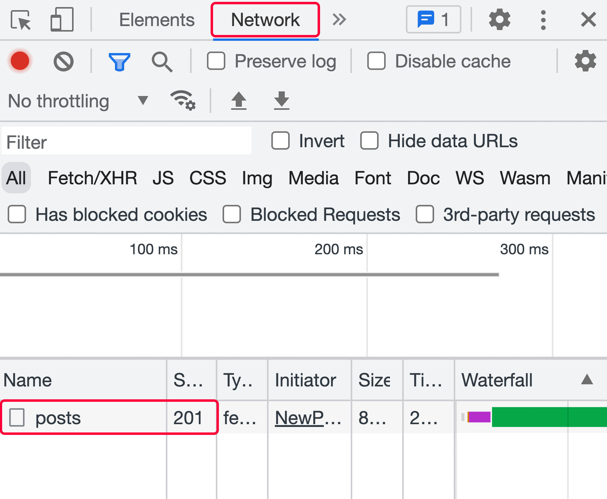

1. Inside the `NewPost` component, in the `handleSubmit` function, use the `fetch()` function to send a `POST` request to https://jsonplaceholder.typicode.com/posts:

   ```js
   function handleSubmit(event) {
     event.preventDefault();

     fetch('https://jsonplaceholder.typicode.com/posts', {
       method: 'POST',
       body: JSON.stringify({ title: enteredTitle }),
     });
   }
   ```

2. You can confirm that everything works as intended and view the network request in the browser developer tools via the "Network" tab:

   

   `useEffect()` is not required for this outgoing request because the HTTP request is not triggered when the component function is invoked but rather when the form is submitted.

   Indeed, if you tried to use `useEffect()` for this request, you’d have to get creative as using `useEffect()` inside of `handleSubmit` violates the rules of Hooks.

3. To fetch blog posts when the app is rendered, you should `import useEffect from 'react'` in `App.jsx`. Thereafter, inside the `App` component, call `useEffect()` directly in the component function and pass an effect function (an empty function for now) and an empty dependencies array to the effect:

   ```jsx
   import { useEffect } from 'react';

   import BlogPosts from './components/BlogPosts.jsx';
   import NewPost from './components/NewPost.jsx';

   function App() {
     useEffect(function () {}, []);

     return (
       <>
         <NewPost />
         <BlogPosts />
       </>
     );
   }

   export default App;
   ```

4. Inside the effect function (in the `App` component), send a `GET` request via the `fetch()` function to https://jsonplaceholder.typicode.com/posts.

   To extract the response and response data in a convenient way, wrap the HTTP request code in a separate `async` function `loadPosts` (defined as part of the effect function), which is called in the effect function.

   `await` both the response as well as the data extracted from the response (via the `json()` method):

   ```js
   useEffect(function () {
     async function loadPosts() {
       const response = await fetch(
         'https://jsonplaceholder.typicode.com/posts'
       );

       const blogPosts = await response.json();
     }

     loadPosts();
   }, []);
   ```

   Keep in mind that the effect function itself must not be turned into an `async` function since it must not return a promise.

5. Add a state value (named `loadedPosts` here) to the `App` component and set the state value from inside `loadPosts()` (the function in the effect function) to the fetched `blogPosts` value.

   Pass the `loadedPosts` state value to `<BlogPosts>` via props (for example, via a `posts` prop):

   ```jsx
   import { useState, useEffect } from 'react';

   import BlogPosts from './components/BlogPosts.jsx';
   import NewPost from './components/NewPost.jsx';

   function App() {
     const [loadedPosts, setLoadedPosts] = useState([]);

     useEffect(function () {
       async function loadPosts() {
         const response = await fetch(
           'https://jsonplaceholder.typicode.com/posts'
         );

         const blogPosts = await response.json();
         setLoadedPosts(blogPosts);
       }

       loadPosts();
     }, []);

     return (
       <>
         <NewPost />
         <BlogPosts posts={loadedPosts} />
       </>
     );
   }

   export default App;
   ```

6. Inside of `BlogPosts`, render the list of blog posts received via props by mapping all blog post list items to `<li>` elements.

   Output the blog post titles in the list:

   ```jsx
   function BlogPosts({ posts }) {
     return (
       <ul className={classes.posts}>
         {posts.map((post) => (
           <li key={post.id}>{post.title}</li>
         ))}
       </ul>
     );
   }
   ```

7. For the bonus task, inside of the `NewPost` component, add a new state value called `isSendingRequest` via `useState()`. Set the state to `true` right before the `POST` HTTP request is sent and to `false` thereafter.

   Wait for the request to complete by turning `handleSubmit` into an `async` function and `await` the `fetch()` function call:

   ```jsx
   import { useState } from 'react';

   import classes from './NewPost.module.css';

   function NewPost() {
     const [enteredTitle, setEnteredTitle] = useState('');
     const [isSendingRequest, setIsSendingRequest] = useState(false);

     function handleUpdateTitle(event) {
       setEnteredTitle(event.target.value);
     }

     async function handleSubmit(event) {
       event.preventDefault();

       setIsSendingRequest(true);

       await fetch('https://jsonplaceholder.typicode.com/posts', {
         method: 'POST',
         body: JSON.stringify({ title: enteredTitle }),
       });

       setIsSendingRequest(false);
       setEnteredTitle('');
     }

     // JSX code didn’t change…
   }

   export default NewPost;
   ```

8. Still inside `NewPost`, set the `<button>` caption conditionally based on `isSendingRequest` to either show `"Saving..."` (if `isSendingRequest` is `true`) or `"Save"`:

    ```jsx
    return (
      <form onSubmit={handleSubmit} className={classes.form}>
        <div>
          <label>Title</label>
          <input type="text" onChange={handleUpdateTitle} value={enteredTitle} />
        </div>
        <button disabled={isSendingRequest}>
          {isSendingRequest ? 'Saving...' : 'Save'}
        </button>
      </form>
    );
    ```
