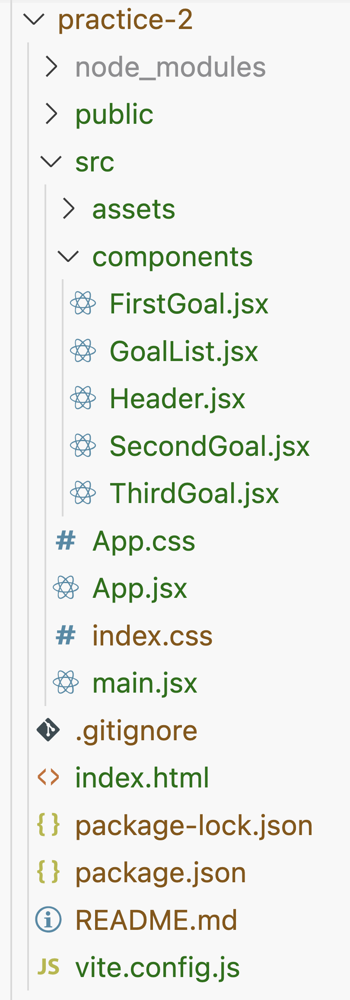

1. Create a new React project by running `npm create vite@latest my-app`. Choose "React" and "JavaScript".

   You can replace `my-app` with any name of your choice, and you can run this command in any fitting place on your system (e.g., on your desktop). Start the development web server by running npm run dev inside the created project folder.

2. Create a new `src/components` folder in the project.

3. In the `/src/components` folder, create multiple component files—for example, `FirstGoal.jsx`, `SecondGoal.jsx`, `ThirdGoal.jsx`, `GoalList.jsx` and `Header.jsx`.

   Your project folder should now look like this:

   

4. Edit the individual goal component files (`FirstGoal.jsx`, etc.) and define and export component functions inside of them.

   Every component function should return a list item with any JSX markup of your choice and the goal title and text as main content.

   Here’s an example for the first goal:

```jsx
function FirstGoal() {
  return (
    <li>
      <article>
        <h2>Teach React in a highly-understandable way</h2>
        <p>
          I want to ensure, that you get the most out of this book 
          and you learn all about React!
        </p>
      </article>
    </li>
  );
}

export default FirstGoal;
```

5. In the `GoalList.jsx` file, define and export a `GoalList` component function and import the individual components. Thereafter, return JSX code that renders an unordered list (`<ul>`) with the custom goal components as list items:

```jsx
import FirstGoal from './FirstGoal.jsx';
import SecondGoal from './SecondGoal.jsx';
import ThirdGoal from './ThirdGoal.jsx';

function GoalList() {
  return (
    <ul>
      <FirstGoal />
      <SecondGoal />
      <ThirdGoal />
    </ul>
  );
}

export default GoalList;
```

6. In the `Header.jsx` file, define and export a `Header` component and return some header JSX markup:

```jsx
function Header() {
  return (
    <header>
      <h1>My Goals For This Book</h1>
    </header>
  );
}

export default Header;
```

7. Import the `GoalList` and `Header` components into the `App.jsx` file and replace the default JSX code with your own JSX code that renders these two components:

```jsx
import GoalList from './components/GoalList.jsx';
import Header from './components/Header.jsx';

function App() {
  return (
    <>
      <Header />
      <main>
        <GoalList />
      </main>
    </>
  );
}

export default App;
```
